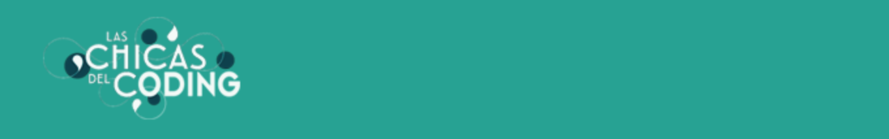

Welcome to our first collaborative web!

# Las Chicas del Coding

We are [Arantxa](https://github.com/ArantxaDR), [Araceli](https://github.com/AraceliLobo), [Milda](https://github.com/Milda-Grabyte), [Celia](https://github.com/Celiamf) & [Ana](https://github.com/anamartinezfernandez). Our team name was inspired by the story of Las Chicas del Cable show, whose main characters had the courage to face the social restrictions of their time and fought to find their way in a male-dominated world. We too are five brave women starting our path in front-end development at [Adalab](https://github.com/Adalab), and we will do our best to become the best!

Visit our web site [here](http://beta.adalab.es/project-promo-k-modulo-1-team-3/) to learn more about us!

# Description

This project was developed as part of the Adalab 1st Module on **HTML & CSS**. We created a web site to introduce ourselves, provide a way to contact us and mostly practice our web building skills. We used **SCSS, Flexbox & Grid** for the layout and **Git** for version control.

# Installation & Getting Started

We also used **node & gulp**, so you'll need to run the following commands in your terminal after you clone the repository:

```bash
npm install
```

```bash
npm start
```

A new window will open in your browser showing the website. If you want to make changes on the code, you can edit the files on `src/` and they will show on your browser.

<hr>
💜 Thanks for your visit and let us know if you have any suggestions on our code!
